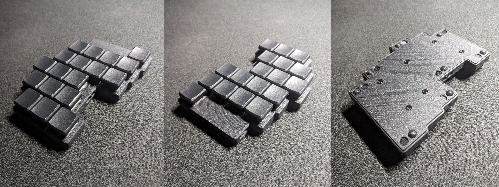

# hEnki

hEnki is my hand-wired implementation of Enki keyboard by [Aroum](https://github.com/aroum).

## Features

* 36/42 keys
* Kailh Choc V1 switches
* Choc spacing
* Hotswap Sockets
* Wireless
* Case with magnets
* Power switch and reset button
* 18mm total height with MBK Keycaps and bumpons

# BOM

| Item                                                                   | Quantity | Remarks                              |
| ---------------------------------------------------------------------- | -------: | ------------------------------------ |
| [Switches](https://aliexpress.ru/item/32959996455.html)                | 36/42    | Kailh Choc V1                        |
| [Sockets](https://aliexpress.ru/item/32901654130.html)                 | 36/42    | Kailh Choc V1 Hotswap Socket         |
| [Keycaps](https://aliexpress.ru/item/33026798318.html)                 | 36/42    | 1U (choc spacing)                    |
| [Controllers](https://aliexpress.ru/item/1005006035267231.html)        | 2        | Supermini NRF52840                   |
| [Li Po Batteries](https://aliexpress.ru/item/1005001388585634.html)    | 2        | 100mAh 601120                        |
| [Power sliders](https://aliexpress.ru/item/1005005471596185.html)      | 2        | BSI-10H                              |
| [Reset switches](https://aliexpress.ru/item/1005005826296317.html)     | 2        | 4.5x4.5x6mm                          |
| [Wires](https://aliexpress.ru/item/32947233235.html)                   | -        | UL1423 PTFE 28AWG                    |
| [Standoffs](https://aliexpress.ru/item/32968906213.html)               | 12/16    | m2x4                                 |
| [Screws](https://aliexpress.ru/item/1005004494509456.html)             | 12/16    | m2x4                                 |
| [Magnets](https://aliexpress.ru/item/1005004252873806.html)            | 7/14     | 15x8x1mm                             |
| [Bumpons](https://aliexpress.ru/item/1005004784336863.html)            | 16       | 8x2mm                                |

# Frimware

ZMK config available [here](https://github.com/vrifmus/henki_zmk-config)

# Models

Files available in [releases](/releases)

# Printing

I'll recommend you to use [OrcaSlicer](https://github.com/SoftFever/OrcaSlicer).
Top of case printing upside-down, bottom in normal orientation.

## Settings

### Quality

* Walls and surfaces
  * Only one wall of first layer: True

### Supports

* Supports
  * Threshold angle: 25 (65)
* Advanced
  * Don't support bridges: True

# Assembly

## Standoffs

Insert screw in standoff, place on mount hole, using small force, wiggle it while he not place.
Remove the screw and press it all the way in with something flat.
Place all standoffs.

## Sockets

Cut off small keys from square side of sockets. Place all sockets, square half (where we cut keys) must be on right side.
Press them in all the way in with something flat.

## Rows

Bend top parts of the sockets left contacts to the borders of hole.
Place diodes, cathode (black) is point to up side.
Cut off the excess part, solder to the two resulting points on the socket.
Form rows from other side of diode wires. Cut off the excess parts. Solder them.

## Columns

Lift up the right half of the sockets. Bend contacts, using wires make the columns.
Common length of wire, between sockets is 15mm. Thumb keys are shifted, length of the wires are higher, measure it.
Strip 2 mm of insulation from each side.

## Scheme

Bottom right pin unused in 36 key version.

## Controller

Using scheme, measure wires, cut them and solder on controller.

## Routing

Place controller. Route wires under rows/columns where it possible.

## Power

Place power slider and reset switch, solder. Place battery, solder and isolate contacts.

## Cover

Place the magnets. Tighten the screws. Stick on the bumpons.

# Final look

